# Intro to Vivado for Software Engineers

Apparently many software engineers hear about FPGA's, they get excited enough to buy a FPGA dev board. They install the tools and open it up and are immediately dazzled by all of the features and then give up and never touch their FPGA board again. This is meant to be a quick helpful tutorial to help someone with a software background get started with FPGA's. Rather than getting bogged down in nitty gritty details of VHDL and TCL syntax, I'm just going to go over it by looking through a basic example.

This specific tutorial uses Digilent's Arty board and VHDL.

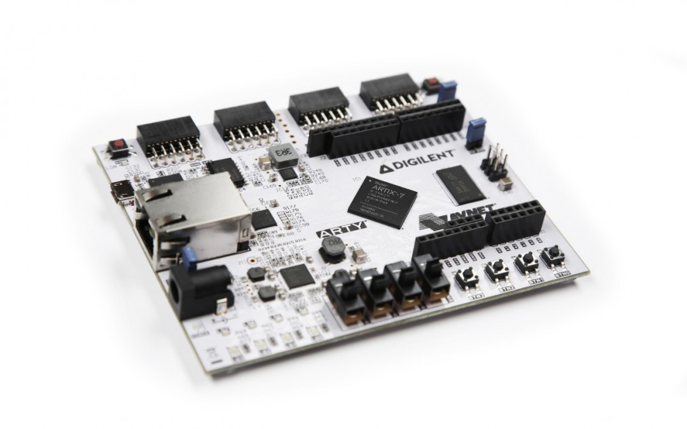

This tutorial assumes you've downloaded, licensed, and installed Vivado. This also assumes that you've figured out the right switch settings to set on your board, and you got the USB driver working.

## Source Files
The first thing that you need to understand about in FPGA designs are your source files. You have two types of source files. Your HDL which defines the logic and your constraints.

The most important constraints that a simple FPGA design needs are pin locations. You obviously can't use whichever pins you want. If you want to blink an LED, you'll need to know which pin is connected to the LED. Usually if you buy a dev board, the board vendor will provide you with a constraint file that tells you where all of the pins are. If they don't, then they usually provide you with a schematic of the board and you'll have to write it yourself from scratch. Which isn't very fun. Constraint files in Vivado have the extension XDC. The syntax of an XDC file is TCL (the scripting language). Vivado will essentially just execute your XDC file like a TCL script to assign pin locations to your signals. If the only thing that we want to do is to blink an LED then we probably only need a clock and an LED pin. We can delete the rest of the constraints.

To blink some lights on our arty board we need the following constraint file.

top.xdc
```tcl
set_property -dict { PACKAGE_PIN E3    IOSTANDARD LVCMOS33 } [get_ports { clk100mhz }];
create_clock -add -name sys_clk_pin -period 10.00 -waveform {0 5} [get_ports { clk100mhz }];
set_property -dict { PACKAGE_PIN H5    IOSTANDARD LVCMOS33 } [get_ports { led }];
```

These are copied directly from the XDC file that was provided by Digilent. The biggest change is that I renamed led[0] to led. There's a lot of information in these constraints. The most important bits are the `PACKAGE_PIN X` and the `get_ports { Y }`. X is which pin of the FPGA we are using and Y is the port name we will use in our VHDL.

The other type of source file is the HDL. You get to choose VHDL or Verilog. While there are alternatives, I wouldn't say that any of them are mature enough to use them as a starting language yet. For this tutorial, I will use VHDL because it's what I'm more familiar with, but the two languages aren't really that different in their capabilities. HDLs describe logic and the connections between components. There are two types of components: registers (sequential logic) that updates every clock tick and combinational logic which updates pretty much immediately. As an example, I'm going to go through a simple blinking lights example so you can get a feel for the basic structure of a VHDL file.

top.vhd
```vhdl
library ieee;
use ieee.std_logic_1164.all;
use ieee.numeric_std.all;

entity top is
  port (
    clk100mhz : in std_logic;
    led : out std_logic
  );
end top;

architecture behavioral of top is
  signal counter : integer range 0 to 100_000_000 := 0;
begin

  led <= '1' when counter > 50_000_000 else '0';
  
  process(clk100mhz)
  begin
    if rising_edge(clk100mhz) then
      counter <= counter + 1;
    end if;
  end process;

end behavioral;
```

Vivado will read this VHDL description and infer logic that looks like this:

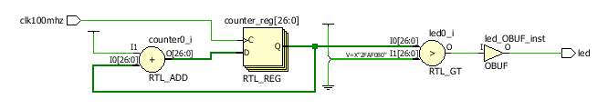

In this schematic, you can see there is a register, an adder, and a comparator. The register and adder will just continuously count up to a 100 million and then rollover and do it again. The comparator will shine the LED if the register is greater than than 50 million. The comparator and adder are combinational component and the counter is a register.

I'll break down each of the bits of the VHDL:
```vhdl
library ieee;
use ieee.std_logic_1164.all;
use ieee.numeric_std.all;
```
This is boring boiler plate you will need in nearly every component. These standard libraries define most of the types used in modern VHDL.

```vhdl
entity top is
  port (
    clk100mhz : in std_logic;
    led : out std_logic
  );
end top;
```
The two important pieces here are giving this component a name (`top`), and we declare our port names, their directions and their types. Both of the types of these ports are `std_logic`. There's a lot of interesting things that `std_logic` can do, but in this case, it's only interesting property is the fact that you can assign them the value `'1'` and the value `'0'`. They are useful for describing single-bit wires or pins.

```vhdl
architecture behavioral of top is
  signal counter : integer range 0 to 100_000_000 := 0;
begin
```
You can create multiple implementations of the same component. Honestly, this feature of VHDL isn't used very often. 99.9% of VHDL entities only have one architecture (named 'Behavioral' or 'rtl'). But we still need to give it a name. The name in this example is `behavioral`. In between the `is` and the `begin` are where you put your declarations (signals, constants, functions, etc). In this example we declare one signal named `counter`. We also declared it's type (`integer range 0 to 100_000_000`) and it's initial value (`0`). In VHDL we can specify any range of integer that we would like. This specific integer goes from 0 to 100 million. VHDL integers wrap, so if I increment this particular signal when it's current value is 100 million, it's new value would be 0.

In VHDL you can construct combinational logic through assignment of expressions. Expressions can use operator primitives like +, -, and, or, not, etc. Here's an example of a VHDL combinational expression.

```vhdl
signal_name <= foo + bar; 
```

It's important to understand that this combinational statement doesn't execute at a particular moment in time, it is continuously executing. `signal_name` is wired to the output of the result of a adder connected to `foo` and `bar`. As `foo` and `bar` change over time, `signal_name` will short time afterward to the sum of `foo` and `bar`.

In our blinken-lights example we have a slightly more complicated expression:
```vhdl
led <= '1' when counter > 50_000_000 else '0';
```

This is the form for conditional assignment in combinational logic. It doesn't look too different than conditional assignments you might see in C or python.

One of the basic building blocks of an FPGA is a register. A register is a building block that we use to store the current circuit state. A register stores data every single clock cycle. Any signals that you want to store inside of a register must be able to travel through any combinational logic and routing delays and reach the register before the rising clock edge. If Vivado doesn't think that the signal will be able to get to the flop in time, it will fail your compile.

This is the basic pattern of what a register looks like in VHDL

```vhdl
process(clk100mhz)
begin
  if rising_edge(clk100mhz) then
    signal_name <= next_value;
  end if;
end process;
```
This process is assigning a new value to `signal_name` every rising edge of the clock. Any signal that is assigned inside of the rising edge of a clock will infer a register. So Vivado will recognize that `signal name` is a register. `next_value` doesn't need to be a signal. It can be an expression and Vivado will infer the necessary combinational logic that feeds into the register's next value.

This section in our blinken-lights example is the counter implementation.
```vhdl
process(clk100mhz)
begin
  if rising_edge(clk100mhz) then
    counter <= counter + 1;
  end if;
end process;
```
The counter's assignment in the clocked process means we want a register. The expression `counter + 1` means every clock cycle we would like this register to be incremented. The clock's frequency is 100MHz so we are incrementing this counter at 100,000,000 times per second. If you recall, our specific counter has a range from 0 to 100,000,000 so this counter will wrap around once per second.

This is a waveform of the behavior we expect to see for the first few 50 nanoseconds:

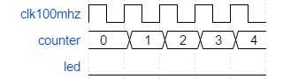

Then after a half second has elapsed, it should do this

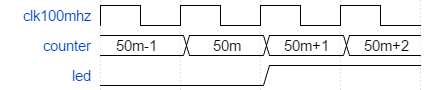

Then after a second has elapsed, it should do this.

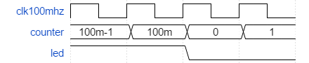

While there are many other features of VHDL, most of it is just based around the concepts we have just used. Assignments within clocked processes will create registers, all other logic is combinational.

## Bitfile generation
Now that we understand our source files, let's try to compile. We compile our constraints and HDL files into bitfiles that we can transmit to the FPGA chip. Similar to how SW has steps like parsing, object code generation, and linking, FPGA designs also have discrete steps. I'm not going to talk too much about what they do, but it's important to understand the general order that they occur in.

* Synthesis
  * Elaboration
  * Technology Map
* Implementation
  * Place
  * Route
* Bitstream Generation

In terms of Vivado commands to invoke these steps they are
* `synth_design`
* `place_design`
* `route_design`
* `write_bitstream`

Now at this point you might open up Vivado in GUI mode, create a project, add your files and start pushing buttons. That would work, but honestly, I think a less intimidating path for a software engineer learning their way around this tool for the first time is to invoke Vivado in batch mode. Invoking Vivado in batch mode means that Vivado will execute a fixed set of steps from a script.

Here's an example of a TCL script you might use:
build.tcl
```tcl
read_vhdl top.vhd
read_xdc top.xdc
synth_design -top top -part xc7a35ticsg324-1L
place_design
route_design
write_bitstream blinky.bit
```
This isn't a whole lot more than the Vivado commands we just learned. Notice that `synth_design` has a few more arguments, we had to specify the top and the part number. Before we synthesized, we had to read the source files in and we gave the output file name to the `write_bitstream` command.

You can see how this is roughly analogous to a Makefile for a software project. We specified our source files and the commands to invoke for our compiler.

Assuming we have our source files in the right place with the right names and Vivado in our path, then we should be able to invoke Vivado from commandline.
```
vivado -mode batch -source build.tcl
```
You should see a bunch of noise rain down from the console as it compiles the design but assuming you didn't mess anything up, then it should've eventually said something like: `INFO: [Vivado 12-1842] Bitgen Completed Successfully.` and spit out a bitfile named `blinky.bit`. Then we need to send the bitfile to the FPGA.

## Downloading the bitfile
For Vivado's hardware manager, I'd probably recommend doing this from GUI mode the first time. If you launch Vivado in GUI mode, there's a big friendly button for "Open Hardware Manager".

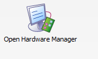

Give that a click. One of the neat things about Vivado is that it displays what TCL commands you are executing when you push a button in the GUI. I like to follow along with what buttons I'm clicking to see what Vivado is doing. You can open up the TCL console and type the commands in to execute it again. You can also paste in a bunch of sequential steps and it will execute them as if you clicked them. So that's a neat feature.

By clicking the Open Hardware Manager button, you should've executed `open_hw`. At this point, we make sure our FPGA is connected to the computer, it's in JTAG mode, and powered on correctly, and the drivers installed correctly.

Now we want to auto-connect. There's a little icon with a green board and yellow down arrow. It's also an option if you click the Open target text up near the top.

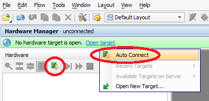

If you click that, the Tcl prompt tells us that we executed `connect_hw_server`, `open_hw_target`, `current_hw_device [lindex [get_hw_devices] 0]` and `refresh_hw_device -update_hw_probes false [lindex [get_hw_devices] 0]`. All this is doing is finding out what devices you currently have connected to this machine and it sets the current device to what is probably your own Xilinx dev board you have connected to your computer.

We are doing a JTAG scan of our system. The JTAG scan is capable of doing some pretty neat poking around on our hardware (for instance, apparently my FPGA is apparently 36.0 degrees celsius), but the reason we are here is to download our bitfile.

I just right-click my FPGA (xc7a35t) and click program device

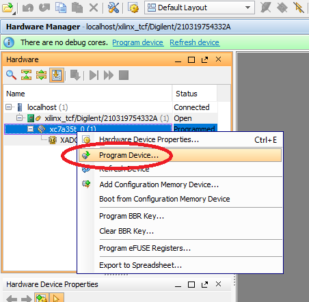

Once you browse to your bitfile, the Tcl console says we downloaded it successfully.

Neat. So now the LED should be blinking. We have blinken-lights!

So if you've read everything above, then you should know

* The basic structure of XDC and VHDL files and their purpose
* How to generate a bitfile in Vivado from a TCL script
* How to download a bitfile to an FPGA target using Vivado's Hardware Manager

That's enough to try out little experiments with buttons, switches and leds.

## Schematic Viewer and the Technology Library

You might remember that I showed you a pretty picture that showed how Vivado interpreted our VHDL. When you are learning VHDL it's easy to get confused about which features of the language are for simulation and which are for synthesis. Also, sometimes when you are first trying out VHDL, you might end up writing VHDL that doesn't really make sense in terms of hardware. For this reason, I think it's very valuable to use Vivado's schematic viewer to get an idea of what logic you are describing.

So let's take a look at a piece of VHDL I wrote a while ago for a VGA controller.

vga_controller.vhd
```vhdl
library ieee;
use ieee.std_logic_1164.all;
use ieee.numeric_std.all;

library unisim;
use unisim.vcomponents.all;

entity vga_controller is
  port (
    clk100mhz : in std_logic;
    h_sync : out std_logic;
    v_sync : out std_logic;
    disp_ena : out std_logic;
    row : out unsigned(9 downto 0);
    col : out unsigned(9 downto 0);
    pclk : out std_logic
  );
end vga_controller;

architecture behavioral of vga_controller is

  signal pix_clk : std_logic;
  signal clkfb : std_logic;
  
  signal h_sync_nxt : std_logic;
  signal v_sync_nxt : std_logic;
  signal disp_ena_nxt : std_logic;

  constant h_display_time : integer := 640;
  constant h_front_porch : integer := 16;
  constant h_sync_time : integer := 96;
  constant h_back_porch : integer := 48;
  
  constant v_display_time : integer := 480;
  constant v_front_porch : integer := 10;
  constant v_sync_time : integer := 2;
  constant v_back_porch : integer := 33;
  
  constant hsync_start : integer := h_display_time + h_front_porch;
  constant hsync_end : integer := hsync_start + h_sync_time;
  constant end_of_line: integer := hsync_end + h_back_porch;
    
  constant vsync_start: integer := v_display_time + v_front_porch;
  constant vsync_end: integer := vsync_start + v_sync_time;
  constant end_of_frame: integer := vsync_start + v_back_porch - 1;

  signal h_counter : unsigned(9 downto 0);
  signal v_counter : unsigned(9 downto 0);

begin
--26892
  clocking : plle2_base
  generic map (
    bandwidth          => "optimized",
    clkfbout_mult      => 8,
    clkfbout_phase     => 0.0,
    clkin1_period      => 10.0,

    clkout0_divide     => 32,
    clkout0_duty_cycle => 0.5,
    clkout0_phase      => 0.0,

    divclk_divide      => 1,
    ref_jitter1        => 0.0,
    startup_wait       => "false"
  )
  port map (
    clkin1   => clk100mhz,
    clkout0 => pix_clk,
    clkfbout => clkfb,
    clkfbin  => clkfb,
    pwrdwn   => '0',
    rst      => '0'
  );
  
  process(pix_clk)
    begin
      if rising_edge(pix_clk) then
      
        -- update all output buffer regs
        h_sync <= h_sync_nxt;
        v_sync <= v_sync_nxt;
        disp_ena <= disp_ena_nxt;

        
        -- update counters
        if h_counter < end_of_line then
          h_counter <= h_counter + 1;
        else
          h_counter <= (others=>'0');
          if v_counter < end_of_frame then
            v_counter <= v_counter + 1;
          else
            v_counter <= (others=>'0');
          end if;
        end if;
      end if;
    end process;
  
  col <= h_counter;
  row <= v_counter;
  h_sync_nxt <= '0' when h_counter > hsync_start and h_counter < hsync_end else '1';
  v_sync_nxt <= '0' when v_counter > vsync_start and v_counter < vsync_end else '1';
  disp_ena_nxt <= '1' when h_counter < h_display_time and v_counter < v_display_time else '0';

  pclk <= pix_clk;
end behavioral;
```
I'm not going to talk too much about why it works how it works, but you should be able to pick out the input and output ports, the declarations, the combinational logic, and the register assignments inside of the clocked process.

Suppose you want to see a block diagram of what this VHDL looks like. Let's open up Vivado again in GUI mode. Then instead of pushing buttons to start a project let's just type in a couple of commands into the TCL console.

First let's read this VHDL file.
```
read_vhdl vga_controller.vhd
```
That looks like it worked, now let's synthesize it. We aren't going to do all of the steps of synthesis, we are only going to do the RTL-level synthesis. Also, this specific component isn't designed to be the top level component on the FPGA so we are going to synthesize this out of context.
```
synth_design -mode out_of_context -top vga_controller -rtl
```
Cool. It worked. On the left side of the screen it probably shows the RTL netlist window. It also might've opened up a window in the center view. That might be the schematic. Sometimes it opens up a different window. In any case, if you want to look at the schematic for any component, you can right click it in the RTL netlist window and there's an option for schematic that you can click.

And that should open up a window that shows you a schematic view of the circuit. From looking at this schematic view you can see all of the combinational logic in the middle and along the right edge you should be able to see 5 registers, some of them are single bit, some of them are multi-bit. At the top, you can see a big component called a PLL that I instantiate in my VHDL.

If you are really curious about what a PLL is, PLL's are a primitive in the tech library of this specific family of FPGAs that allow you to generate new clock sources from an existing clock source. In this design, I start with a 100 MHz clk and the PLL uses it to generate a 25MHz clock named pclk, which I use to update my VGA signals. There are other ways to divide clock signals, but PLL's have a lot of advantages.

If you want to know what other neato little primitives are in your tech library, Xilinx publishes an excellent document that lists off useful macros and primitives: https://www.xilinx.com/support/documentation/sw_manuals/xilinx14_7/7series_hdl.pdf. In our VHDL we instantiated a PLLE2_BASE, which is on page 357 of that document. It has a written description, a description of each of the ports and attributes, and an example of how to instantiate it.

If we started over and omit the `-rtl` option in our `synth_design` command

```
synth_design -mode out_of_context -top vga_controller
```

then we would be presented with a more complicated schematic that looks like this.

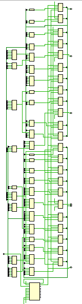

This is a schematic that has complete mapping to the 7-series tech lib, so every single cell in this schematic is an instance of primitive in the tech lib. In this case, all of my combinational logic was implemented with LUTs and all of my registers were implemented with flip flops, and of course the PLL is still there at the bottom.

You might ask, if I can infer LUTs and FF's, can I infer PLLs? The answer is again, in the Xilinx Tech Lib guide. There's an entry in the PLLE2_BASE that says Inference: No. So the only way to get this specific primitive is to instantiate it manually.

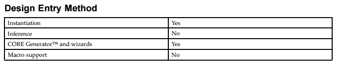

One of the advantages of inferred components over instantiated primitives is that it makes the design more portable. I will not be able to instantiate this PLL primitive on an Altera FPGA for example.

## Hierarchal Design

From a SW world, you might be used to linking against library binaries in your software applications. There are some advantages to pulling in dependencies as precompiled files instead of copying in the source and adding each individual source file of your dependency to your design.

The intermediate form of a digital design is a netlist. Which is a list of components and how they are connected together. The schematics that we have been looking at are simply netlist visualizations. A popular netlist format is EDIF. EDIF lists the components and their connections in S-Expression format, so if you are a fan of LISP, you are going to love EDIF. Many binary formats of netlists are simply compressed or encrypted EDIF files.

Here's an excerpt of an EDIF file.
```
...
   (cell PLLE2_ADV (celltype GENERIC)
     (view netlist (viewtype NETLIST)
       (interface 
        (port CLKFBOUT (direction OUTPUT))
        (port CLKOUT0 (direction OUTPUT))
        (port CLKOUT1 (direction OUTPUT))
        (port CLKOUT2 (direction OUTPUT))
        (port CLKOUT3 (direction OUTPUT))
        (port CLKOUT4 (direction OUTPUT))
        (port CLKOUT5 (direction OUTPUT))
        (port DRDY (direction OUTPUT))
        (port LOCKED (direction OUTPUT))
        (port CLKFBIN (direction INPUT))
        (port CLKIN1 (direction INPUT))
        (port CLKIN2 (direction INPUT))
        (port CLKINSEL (direction INPUT))
        (port DCLK (direction INPUT))
        (port DEN (direction INPUT))
        (port DWE (direction INPUT))
        (port PWRDWN (direction INPUT))
        (port RST (direction INPUT))
        (port (array (rename DO "DO[15:0]") 16) (direction OUTPUT))
        (port (array (rename DADDR "DADDR[6:0]") 7) (direction INPUT))
        (port (array (rename DI "DI[15:0]") 16) (direction INPUT))
       )
     )
   )
   (cell LUT5 (celltype GENERIC)
     (view netlist (viewtype NETLIST)
       (interface 
        (port O (direction OUTPUT))
        (port I0 (direction INPUT))
        (port I1 (direction INPUT))
        (port I2 (direction INPUT))
        (port I3 (direction INPUT))
        (port I4 (direction INPUT))
       )
     )
   )
```

Honestly, it's pretty readable, but you wouldn't want to write it by hand. The way that you generate EDIF files in Vivado is the command `write_edif`. You can do it after RTL synthesis, or full synthesis or even after place or route. The EDIF will just have the information from the stages it has completed so far, and Vivado will complete any stages that it has left. You can add an EDIF file as a source file using the `read_edif` command.

Both VHDL and Verilog allow instantiating components without their definition. This is sometimes called "Black box" instantiation. You are telling Vivado that this component will exist at some point. Vivado will happily synthesize VHDL files without all of the components that are instantiated as long as they are instantiated as a black box.

You can mix and match languages in your input files. Your input files into your Vivado project may include VDHL, Verilog, EDIF, or block diagrams made with Vivado's block diagram editor.

## You still haven't explained Vivado Projects

Yes. You can create Vivado projects from the TCL commands or in GUI mode. The advantages of projects is that it saves checkpoints of the design after it finishes synthesis or implementation. It saves them in a DCP file which is a netlist combined with some other project settings. It also allows you to set default parameters to your commands like the FPGA part number or what mode to run synthesis in. One of the reasons I don't like Vivado projects is they dump loads of crap files and it's difficult to determine which are important to save to version control and which are not. Vivado projects also are painful to move between versions of Vivado. They have a wizard for generating new source files but it usually puts the source files in places I don't want.

One of the ways to make your projects more portable across machines and versions of Vivado is to export a project TCL script. Vivado will write out a TCL script that reproduces all of the settings of the current project. Sometimes it writes things in a funny way so often I edit it afterward to make it cleaner. For instance, sometimes the script saves the source file list with their absolute paths instead of the path relative to the project which is less helpful, or sometimes it saves a lot of settings that I don't care about. The command to write a project tcl is `write_project_tcl`. Usually I use the option `-no_copy_sources`.

One of the nice things about having a project is being able to set your board. If your board vendor is nice, like Digilent then they can provide board files that you can add to your Vivado install. By using a board_part, you automatically import bunch of information about your hardware. For instance, if you are in the block diagram editor, and you create a GPIO block and run Connection Automation, it will ask you whether you want to connect that gpio block to the switches, buttons, or leds. You don't even need to look up where each of those pins are.

Also, there are wizards in Vivado that are really irritating to look up all the information for. One of the wizards is the Memory Interface Generator or MIG. Our board file already has preset settings for all of the DRAM information so we don't need to fill all of that information out.

## Simulation

Right. So remember how I said a while ago that a lot of VHDL syntax is designed for simulation, not actually describing hardware? This is true. So how do we simulate VHDL? Well, you can use open source simulators and waveform viewers or you can use the simulator that is included in Vivado named xsim. Xsim is actually a separate executable, so you can go through and add all of the VHDL files by invoking the xsim commands and then elaborating them from there. Or, you can launch xsim from a Vivado project and it will use the same source files you already added.

Before we simulate, we need a test bench that instantiates our device under test or DUT. I wrote a simple VHDL file, that wraps around my vga_controller that we were looking at earlier.

```vhdl
library ieee;
use ieee.std_logic_1164.all;
use ieee.numeric_std.all;

entity top_sim is
end top_sim;

architecture test_bench of top_sim is
  signal clk100mhz : std_logic := '0';
  signal h_sync : std_logic := '0';
  signal v_sync : std_logic := '0';
  signal disp_ena : std_logic := '0';
  signal row : unsigned(9 downto 0) := (others=>'0');
  signal col : unsigned(9 downto 0) := (others=>'0');
  signal pclk : std_logic := '0';
begin

myproc : process
begin
  while true loop
    clk100mhz <= not clk100mhz;
    wait for 10ns;
  end loop;
end process;

vga_control : entity work.vga_controller(behavioral)
  port map (
    clk100mhz => clk100mhz,
    h_sync => h_sync,
    v_sync => v_sync,
    disp_ena => disp_ena,
    row => row,
    col => col,
    pclk => pclk);

end test_bench;
```
Notice that now I have a process that waits for 10ns. Wait statements don't really make sense in hardware so they are mostly used in simulation. This particular process is simulating the behavior of my clock signal.

So we add this file to our project, and then click the "Run Simulation" button and voila. A wild waveform graph appears!

If we zoom around eventually, we can see some useful information:

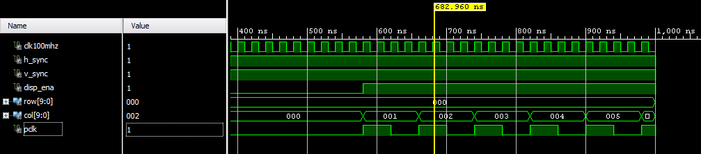

I can inspect this waveform and determine that my device appears to be behaving correctly. In more complex designs, I'd probably just throw a bunch of asserts in my testbench and verify the correct operation programmatically. But for simple designs, it's easiest just to look at it and determine that it is doing what you intend.
